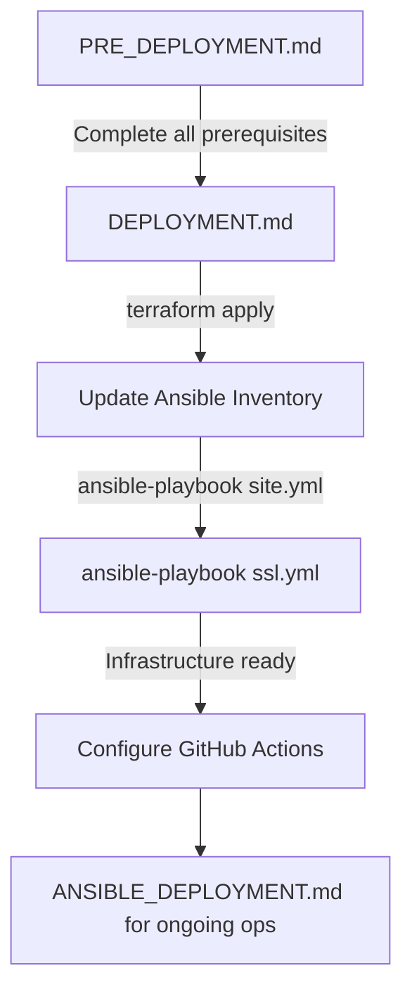

# Deployment Guide Index

This document clarifies the relationship between the three main deployment guides and when to use each one.

## Document Overview

### 1. [PRE_DEPLOYMENT.md](PRE_DEPLOYMENT.md) - Before First Deployment
**When to use**: Before running `terraform apply` for the first time

**What it covers**:
- AWS account setup and IAM user creation
- Installing required tools (Terraform, AWS CLI, GPG, Ansible)
- Generating SSH key pairs (personal + Ansible automation)
- Creating AWS Secrets Manager entries
- Generating GPG keys for backup encryption
- Creating GitHub personal access token
- Configuring `terraform.tfvars` files
- Pre-deployment checklist

**Stop here until**: All prerequisites are complete and you're ready to create infrastructure

---

### 2. [DEPLOYMENT.md](DEPLOYMENT.md) - Initial Infrastructure Setup
**When to use**: After completing PRE_DEPLOYMENT.md, for the first deployment

**What it covers**:
- Running `terraform apply` to create AWS infrastructure
- Configuring DNS at your registrar
- **⚠️ Note**: The current version assumes user-data handles everything, but with Ansible integration, you should:
  1. Run `terraform apply`
  2. Update Ansible inventory with Elastic IPs
  3. Run `ansible-playbook -i inventory/prod.yml playbooks/site.yml`
  4. Run `ansible-playbook -i inventory/prod.yml playbooks/ssl.yml`
- Post-deployment verification
- Infrastructure management (scaling, destroying, etc.)

**Key difference with Ansible**: Instead of SSH'ing to the server and running manual Docker commands, use Ansible playbooks for configuration.

---

### 3. [ANSIBLE_DEPLOYMENT.md](ANSIBLE_DEPLOYMENT.md) - Ongoing Operations
**When to use**: After initial infrastructure is deployed, for day-to-day operations

**What it covers**:
- Deploying application updates: `ansible-playbook playbooks/deploy-app.yml`
- Rolling back deployments: `ansible-playbook playbooks/rollback.yml`
- SSL certificate management: `ansible-playbook playbooks/ssl.yml`
- Detailed Ansible role reference
- Troubleshooting Ansible issues

**⚠️ Note**: Some content overlaps with PRE_DEPLOYMENT (SSH key generation) and DEPLOYMENT (inventory setup). These should be consolidated.

---

## Recommended Workflow

### First-Time Deployment

### Step-by-Step:

1. **Follow PRE_DEPLOYMENT.md** (one-time setup)
   - Set up AWS account, IAM, tools
   - Generate all keys (SSH personal, SSH Ansible, GPG)
   - Create AWS Secrets
   - Configure terraform.tfvars

2. **Follow DEPLOYMENT.md Phase 1** (Terraform)
   - `cd terraform/environments/stage` (or prod)
   - `terraform plan`
   - `terraform apply`
   - Save Elastic IP output
   - Configure DNS at registrar

3. **Ansible Configuration** (bridge between docs)
   - Edit `ansible/inventory/stage.yml`
   - Add Elastic IP as `ansible_host`
   - Test connection: `ansible -i inventory/stage.yml all -m ping`

4. **Run Ansible Playbooks**
   - `ansible-playbook -i inventory/stage.yml playbooks/site.yml`
   - Wait for completion (~10-15 min)
   - `ansible-playbook -i inventory/stage.yml playbooks/ssl.yml`

5. **Post-Deployment**
   - Verify services are running
   - Configure GitHub Actions secrets
   - Test backup system (prod only)

6. **Ongoing Operations** (use ANSIBLE_DEPLOYMENT.md)
   - Application deployments
   - Rollbacks
   - Routine maintenance

---

## Known Overlaps (To Be Resolved)

### SSH Key Generation
- **Appears in**: PRE_DEPLOYMENT.md (section 3) and ANSIBLE_DEPLOYMENT.md (Installation section)
- **Should be in**: PRE_DEPLOYMENT.md only
- **Fix**: Remove from ANSIBLE_DEPLOYMENT.md, reference PRE_DEPLOYMENT instead

### Ansible Inventory Setup
- **Appears in**: DEPLOYMENT.md (manual process) and ANSIBLE_DEPLOYMENT.md (section 2)
- **Should be in**: DEPLOYMENT.md Phase 2
- **Fix**: ANSIBLE_DEPLOYMENT should assume inventory is already configured

### SSL Certificate Setup
- **Appears in**: DEPLOYMENT.md (manual Docker commands) and ANSIBLE_DEPLOYMENT.md (ssl.yml playbook)
- **Should be**: Use Ansible playbook only
- **Fix**: DEPLOYMENT.md should reference running `ansible-playbook playbooks/ssl.yml` instead of manual commands

### GitHub Actions Configuration
- **Appears in**: PRE_DEPLOYMENT.md (before having IPs) and DEPLOYMENT.md (after deployment)
- **Should be in**: DEPLOYMENT.md Phase 4 (post-deployment)
- **Fix**: PRE_DEPLOYMENT should only cover creating the GitHub PAT, not configuring repository secrets

---

## Quick Reference

| Task | Document | Command |
|------|----------|---------|
| AWS setup | PRE_DEPLOYMENT.md | N/A (AWS Console) |
| Generate SSH keys | PRE_DEPLOYMENT.md | `ssh-keygen -t rsa -b 4096 ...` |
| Create Secrets | PRE_DEPLOYMENT.md | `aws secretsmanager create-secret ...` |
| Configure terraform.tfvars | PRE_DEPLOYMENT.md | Edit files manually |
| Deploy infrastructure | DEPLOYMENT.md | `terraform apply` |
| Update inventory | DEPLOYMENT.md | Edit `ansible/inventory/*.yml` |
| Configure server | DEPLOYMENT.md | `ansible-playbook playbooks/site.yml` |
| Get SSL certs | DEPLOYMENT.md | `ansible-playbook playbooks/ssl.yml` |
| Deploy app | ANSIBLE_DEPLOYMENT.md | `ansible-playbook playbooks/deploy-app.yml` |
| Rollback | ANSIBLE_DEPLOYMENT.md | `ansible-playbook playbooks/rollback.yml` |
| Scale instance | DEPLOYMENT.md | Edit tfvars, `terraform apply` |

---

## For Maintainers

To properly reorganize the documentation:

1. **PRE_DEPLOYMENT.md** should end at "ready to run terraform apply"
2. **DEPLOYMENT.md** should:
   - Start with terraform apply
   - Include Ansible inventory update
   - Include running site.yml and ssl.yml playbooks
   - Remove manual Docker/SSH commands (replaced by Ansible)
   - Include GitHub Actions setup (after IPs are known)
3. **ANSIBLE_DEPLOYMENT.md** should:
   - Assume infrastructure exists
   - Assume inventory is configured
   - Focus on deploy-app.yml and rollback.yml
   - Remove SSH key generation (reference PRE_DEPLOYMENT)
   - Keep detailed role reference and troubleshooting

---

## Getting Help

If you're unsure which document to follow:
- **Never deployed before**: Start with PRE_DEPLOYMENT.md
- **Infrastructure exists, need to deploy code**: ANSIBLE_DEPLOYMENT.md
- **Need to change infrastructure**: DEPLOYMENT.md (Managing Infrastructure section)
- **Something broke**: Check Troubleshooting sections in all three docs
